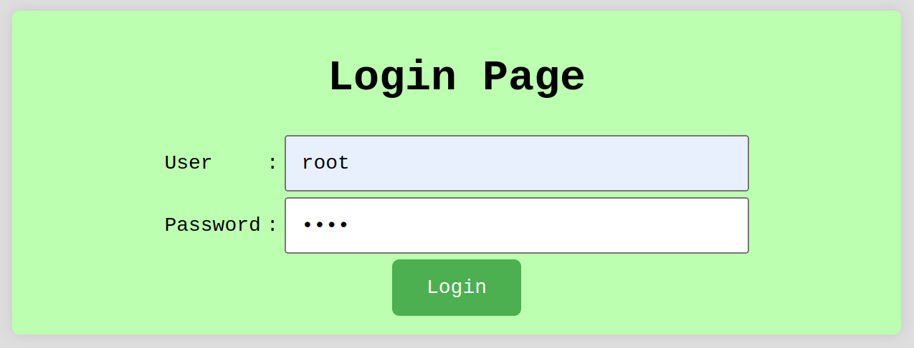

[ [<< Back](../README.md) ]

# Practical Integration: Implementation of All Components

[ [Integration](../integration/) ]

## Overview

This document provides a comprehensive review of recent work and outcomes from Repo Integration. The goal is to combine all learned components into one cohesive unit, tidying up, beautifying, and applying all acquired knowledge to produce a product that serves as a usable platform for further development by other developers.

## Installation Requirements

For effective learning, you will need:
- A Compiler
- XAMPP
- A Browser

## Usage Guidelines

To effectively utilize these materials:
- You'll require a code editor; I use `Visual Studio Code`, but any other compiler is acceptable.
- Throughout your learning journey, you'll rely heavily on `XAMPP` for `Apache` operations in this module. Additionally, `phpMyAdmin` will be used to manage the database.
- A browser is essential for visualizing the output of the code created. You may use your preferred default browser.

## Module Integration: Implementation of All Components

This implementation not only dissects each learned component but also combines them into a finished product ready for further development. In this application, it is essential to note that we cannot access any page or menu arbitrarily because we have implemented a session system on each page. All we can do is log in and then follow the system's available flow.

### Integration: Login Page



This is the login page created with HTML. The default username and password are both set to root. We have slightly improved the appearance using CSS, such as changing the background color, button color, and making other adjustments.

```php
// Dummy authentication, replace with actual authentication logic
if($username === "root" && $password === "root") {
    // Set session
    $_SESSION['user'] = $username;
    
    // Set cookies
    $cookies_name = "root";
    $cookies_value = $username;
    setcookie($cookies_name, $cookies_value, time()+60,"/");
    
    // Redirect to dashboard
    header('location:../admin/dashboard.php');
    exit(); // Make sure to exit after redirect
} else {
    // If login fails
    echo "Login failed";
}
```

### Integration: Dashboard Page


We have added a dashboard page to facilitate navigation or at least to have a dedicated page for managing various buttons that will lead to pages such as data input, data display, and logout. Here, we have also added some color and created buttons with some CSS.

### Integration: Display Page


After clicking the data management button, we are directed to the display page, where we can also edit and delete data. We used a table and added some color to the table and buttons for a better visual experience. Buttons for input and edit functionalities are available, with input for adding data and edit specifically for modifying the selected data, while delete removes the selected data based on the student ID (NIM).

```php
<?php
include '../connection/connection.php';

$nim = $_GET['id'];
$sql = "DELETE FROM Tamu WHERE nim='" . $nim . "'";

if ($conn->query($sql) === TRUE) {
    echo "Record deleted successfully";
} else {
    echo "Error deleting record: " . $conn->error;
}

$conn->close();
?>
```

### Integration: Dashboard Page


We navigate to the data addition or input page.

### Integration: Input Page


We slightly changed the appearance from just HTML to include CSS styling to make it more appealing, simple yet professional.

### Integration: Input Page


Here's the appearance when we try to input data to be sent to the database.

### Integration: phpMyAdmin Page


This is the view of our database before adding the previous data into the database.

### Integration: Output Page


This is the view of the data that has been input. The data is displayed on the output page, and simultaneously, the data has been successfully input into the database as a new NIM. We use NIM as the primary key because NIMs cannot be the same among students. Similar to the input table, the output page is also slightly styled with CSS to make it more visually appealing. We added buttons for data input, database display to show the entire table, and a button to return to the dashboard. The image of the successful input result is placed in the middle at the bottom of the table.

### Integration: Display Page


The data with the new NIM 22030023 has been successfully input along with all other data into our Guest table.

### Integration: Update Page


This is the view when we have clicked the edit button, and as we can see, we have successfully obtained data with a specific NIM, and we just need to fill in the parts we want to update.

### Integration: Display Page


We tried to change the name, department, date, and email, and it worked for us to update, and then the data will be saved in the database table.

### Integration: Delete Page


When we want to delete some data and press the delete button, a warning pop-up like this will appear to confirm whether we are sure to delete the data or not because once deleted, it cannot be restored.

### Integration: Display Page


We can see that data with the NIM 22030018 we selected earlier is no longer in the Guest table list and has been successfully deleted.

### Integration: Logout Page


Then we can log out by accessing the dashboard page, and after pressing something will happen. Can you guess?

### Integration: Login Page


So, shortly after we press the dashboard button, the page will automatically switch back to the login page, and with the session and cookies system we implemented earlier, the session will also be cleared when we log out.

```php
<?php 
session_start();
$_SESSION = array();
session_destroy();
header("location:login.php");
exit();
?>
```

### We Await Your Collaboration

## Contribution

Feel free to fork this repository, and kindly acknowledge the source if used for learning purposes. Alternatively, clone this repository for personal learning.

## License

This repository is licensed under the [Apache License 2.0](https://www.apache.org/licenses/LICENSE-2.0.txt). For more details, refer to the [LICENSE](../LICENSE) file.

## Contact

I'm open to further discussions or collaborations. Please feel

 free to reach out via [Email](mailto:trustedintelegree@gmail.com).

## Additional Information

Reference: "Practical Module Guidebook for Web Engineering" by Agustian, Harliyus, S.Kom., M.Cs. Integrated Laboratory of Adisutjipto Institute of Aerospace Technology, Yogyakarta, 2024.

[ [<< Back](../README.md) ]