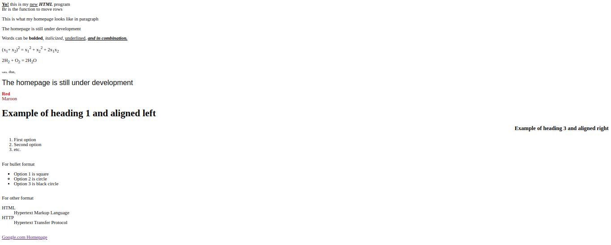
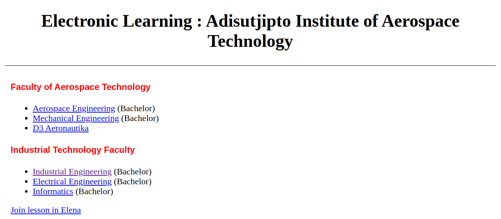
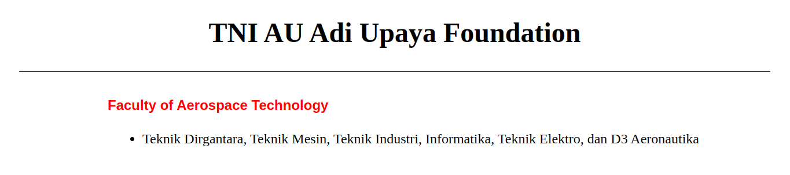

[ [<< Back](../README.md) ]

# Practical Module Archives 1: Introduction to HTML

[ [Module 1](../module1/) ]

## Brief Description

This serves as a brief overview of my recent work and the output from Module 1, aiming to document and provide learning materials for others.

## Installation

In your learning journey, you will need:
- A Compiler
- XAMPP
- A Browser

## Usage

- You'll need a code editor software; here, I use `Visual Studio Code`, but you can use any other compiler.
- In subsequent learning, you'll heavily use `XAMPP`; you can operate `Apache` for this module.
- A browser to display the output of the code you've created. You can use your favorite default browser.
- You can start running your program by pointing your file to display through the browser or can access `htdocs` and place your file there. Then run `localhost/yourfolder/` in the browser.
## Module 1: Introduction to HTML

### Practice 1



Here, we learn about the usage of HTML tags, such as html, head, title, body, writing directly in the body, using the br tag to move to a new line, using p for paragraph, trying font styles like bold (b), italic (i), underline (u), and combining them, learning superscript and subscript attributes with their functions, setting word size with font size, changing typography with font face, changing word color with font color, understanding how to use h1-h6 as headings, using the dl, ol, and li tags for bullets and numbering, and practicing turning text into links with a href.

```
<!DOCTYPE html>
<html lang="en">
<head>
    <title>Hello</title>
</head>
<body>
    <p>Hello World!</p>
</body>
</html>
```

### Task 1



A little play with headers, horizontal lines, and a href to direct to a page.

### Bonuses



Some additional usage in different forms.

## Contribution

Anyone on the internet is allowed to fork this repository, and please just mention the source if you wish to use it as a learning material. Alternatively, feel free to clone this repo for personal learning.

## License

This repository is licensed under the Apache License 2.0. For more details, see the [LICENSE](../LICENSE) file.

## Contact

I'm open to further discussions or collaborations. Please feel free to reach out. Email: trustedintelegree@gmail.com

## Additional

Reference: Practical Module Guidebook for Web Engineering. Agustian, Harliyus S.Kom., M.Cs. Integrated Laboratory of Adisutjipto Aerospace Institute Yogyakarta. 2024.