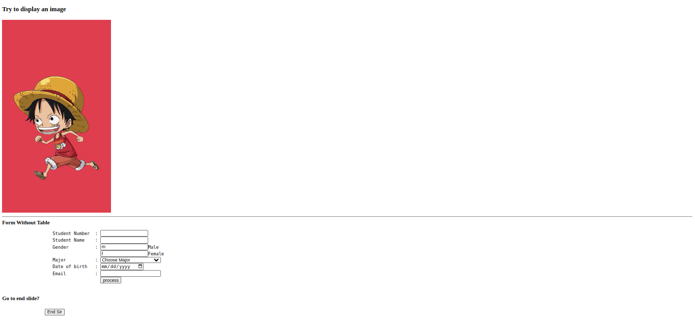
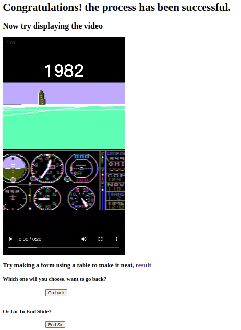
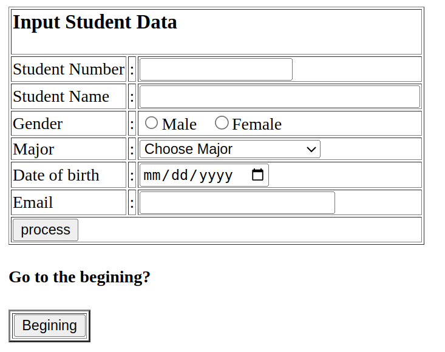
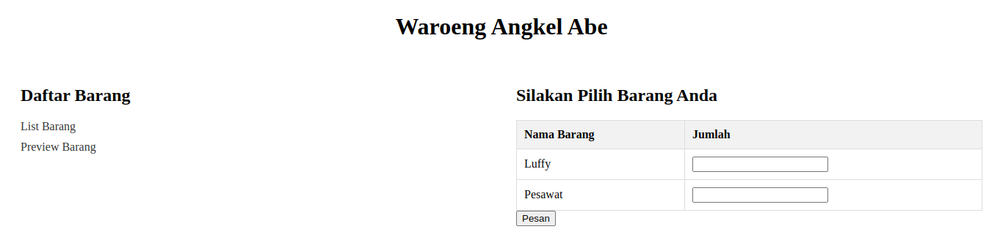
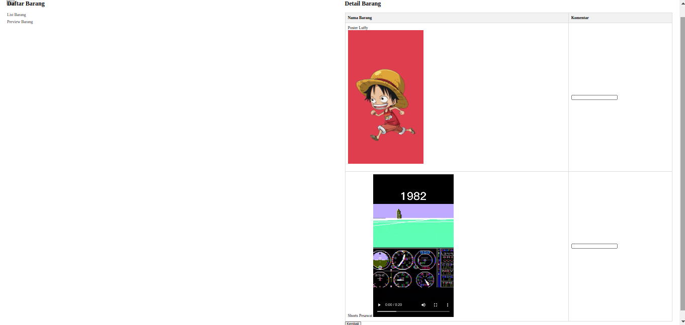

[ [<< Back](../README.md) ]

# Practical Module Archives 2: Advanced HTML

[ [Module 2](../module2/) ]

## Brief Description

This serves as a brief overview of my recent work and the output from Module 2, aiming to document and provide learning materials for others.

## Installation

In your learning journey, you will need:
- A Compiler
- XAMPP
- A Browser

## Usage

- You'll need a code editor software; here, I use `Visual Studio Code`, but you can use any other compiler.
- In subsequent learning, you'll heavily use `XAMPP`; you can operate `Apache` for this module.
- A browser to display the output of the code you've created. You can use your favorite default browser.

## Module 2: HTML Advanced

### Practice 1



Inserting images into a page, creating a simple pure HTML form, creating simple buttons.

This module is a continuation of the previous module where we start learning about using strong, using forms, pre, and tables that contain inputs with types such as text, radio, date, email, understanding the difference between using radio options and option values. Then trying to embed video into the page with the video tag, image with src, and using a href again, using the form action with the post method directed to the destination file. And the application of tr, td colspan, and input type submit.

```html
<h4>Go to end slide?</h4>
<form action="practice3.html" method="post">
    <pre>
        <input type="submit" name="end" value="End Sir">
    </pre>
</form>
```

### Practice 2



Implementation of video in the page with HTML, usage of a href, and simple button.

### Practice 3



Creating a simple form from an HTML table to make it look neater and tidier, and the application of buttons.

### Task 1



Creating a list linked to different pages with a href and creating a slightly styled form table.

### Task 2



Creating a list linked to different image pages and displaying images in a table.

## Contribution

Anyone on the internet is allowed to fork this repository, and please just mention the source if you wish to use it as a learning material. Alternatively, feel free to clone this repo for personal learning.

## License

This repository is licensed under the [Apache License 2.0](https://www.apache.org/licenses/LICENSE-2.0.txt). For more details, see the [LICENSE](../LICENSE) file.

## Contact

I'm open to further discussions or collaborations. Please feel free to reach out. [Email](mailto:trustedintelegree@gmail.com).

## Additional

Reference: "Practical Module Guidebook for Web Engineering" by Agustian, Harliyus, S.Kom., M.Cs. Integrated Laboratory of Adisutjipto Institute of Aerospace Technology, Yogyakarta, 2024.

[ [<< Back](../README.md) ]