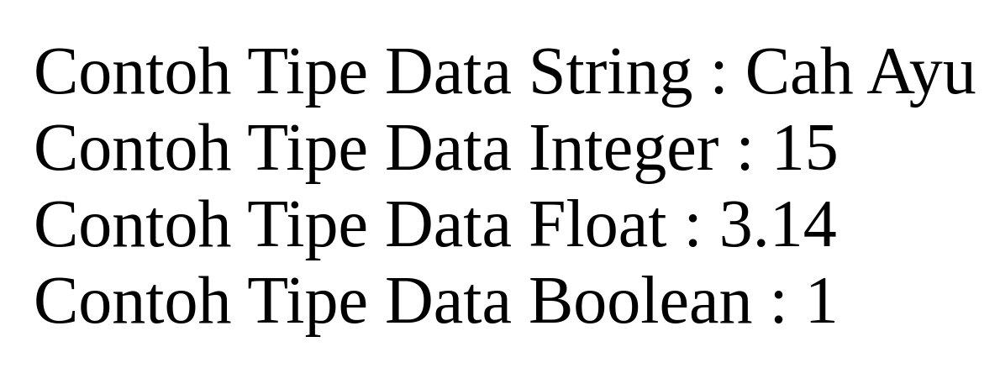
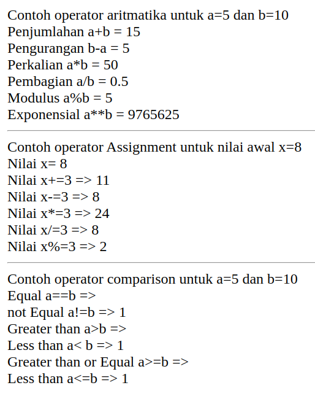
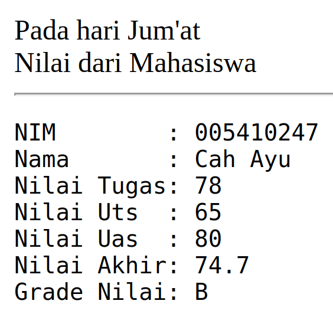
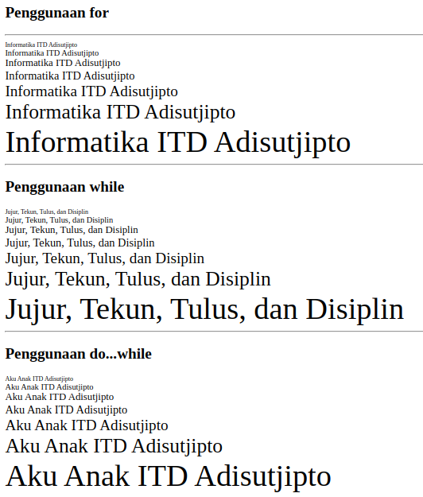
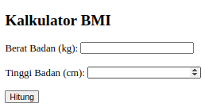
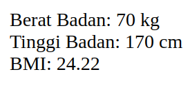

[ [<< Back](../README.md) ]

# Practical Module Archives 3: PHP Fundamentals

[ [Module 3](../module3/) ]

## Brief Description

This serves as a comprehensive overview of my recent work and the output from Module 3, aiming to document and provide learning materials for others.

## Installation

For your learning journey, you will need:
- A Compiler
- XAMPP
- A Browser

## Usage

To utilize this material:
- You'll need a code editor software; here, I use `Visual Studio Code`, but feel free to use any other compiler.
- In subsequent learning, you'll heavily use `XAMPP`, enabling you to operate `Apache` for this module.
- A browser is essential for displaying the output of the code you've created. You can use your preferred default browser.

## Module 3: PHP Fundamentals

### Practice 1



In this chapter, you'll delve into basic PHP, understanding how to declare variables, the necessity of the $ symbol, and ending statements with a semicolon. Also, you'll be introduced to various data types and the usage of print and echo functions.

```php
<?php
$var_char = "Cah Ayu";
$int = 15;
$real = 3.14;
$var_bool = true;

print("Contoh Tipe Data String : ".$var_char."<br>");
echo "Contoh Tipe Data Integer : ".$int."<br>";
print("Contoh Tipe Data Float : ".$real."<br>");
echo "Contoh Tipe Data Boolean : ".$var_bool."<br>";
?>
```

### Practice 2



Comprehend how to write and employ arithmetic operators in PHP for simple calculations.

### Practice 3



Explore the utilization of conditional switches in printing the name of the current day, employing if-elseif conditionals to determine the value to print within certain limits.

### Practice 4



Apply while, for, and do-while loop commands.

### Task 1



Utilize a combination of PHP and HTML to create a table for calculating body mass index input.

### Task 2



Display the results of the calculation of weight and height already declared in the formula.

## Contribution

Feel free to fork this repository, and kindly mention the source if you wish to use it as a learning material. Alternatively, clone this repo for personal learning.

## License

This repository is licensed under the [Apache License 2.0](https://www.apache.org/licenses/LICENSE-2.0.txt). For more details, see the [LICENSE](../LICENSE) file.

## Contact

I'm open to further discussions or collaborations. Please feel free to reach out via email: trustedintelegree@gmail.com.

## Additional

Reference: Practical Module Guidebook for Web Engineering. Agustian, Harliyus S.Kom., M.Cs. Integrated Laboratory of Adisutjipto Aerospace Institute Yogyakarta. 2024.