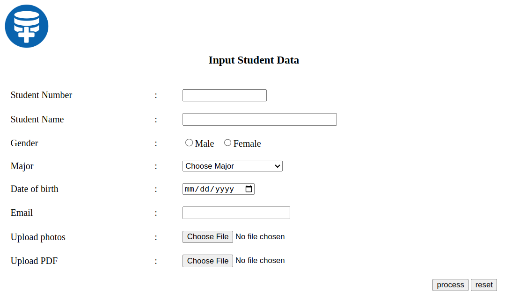
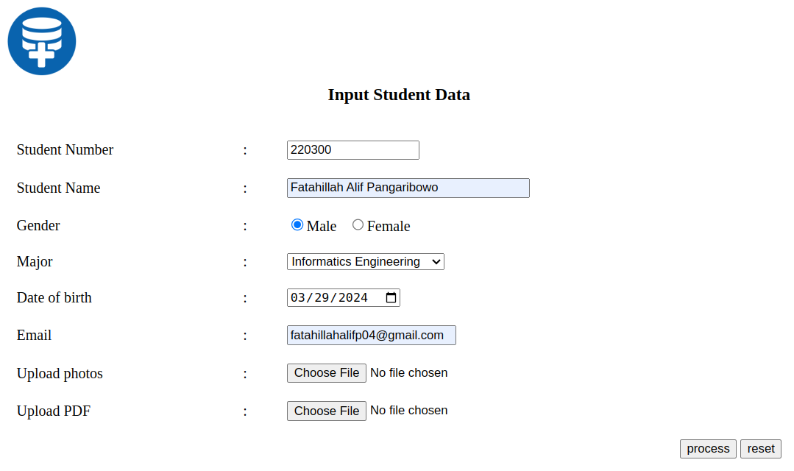
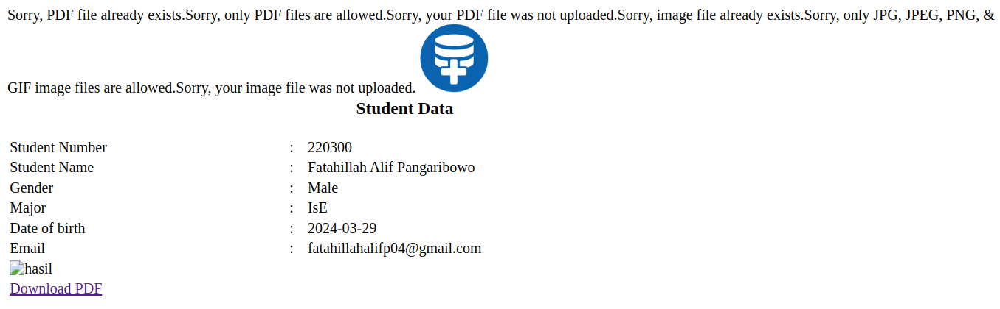

[ [<< Back](../README.md) ]

# Practical Module Archives 4: Advanced PHP

[ [Module 4](../module4/) ]

## Overview

This document provides an in-depth review of my recent work and outcomes from Module 4, aimed at documenting and providing learning resources for others.

## Installation Requirements

For effective learning, you will need:
- A Compiler
- XAMPP
- A Browser

## Usage Guidelines

To effectively utilize these materials:
- You'll require a code editor; I use `Visual Studio Code`, but any other compiler is acceptable.
- Throughout your learning journey, you'll rely heavily on `XAMPP` for Apache operations in this module.
- A browser is essential for visualizing the output of the code created. You may use your preferred default browser.

## Module 4: Advanced PHP

### Practice 1



In this practice, we delve into the usage of `GET` and `POST` methods. You can explore further when to utilize superglobals `$_GET` and `$_POST`. Here, you will create a table for inputting student data, which will later be connected to the `action_form.php` form. This form will be used to process inputs and display the results in the table.

```html
<form action="action_form.php" method="post" enctype="multipart/form-data">
    <table style="width: 80%;">
        <tr>
            <td colspan="3"><h3 align="center">Input Student Data</h3></td>
        </tr>
```

### Practice 2



This is an example of inputting data into the form before being submitted to the output page.

### Practice 3



The output page displays a message above the table as the execution status of the code executed according to the algorithm applied to this form.

## Contribution

Feel free to fork this repository, and kindly acknowledge the source if used for learning purposes. Alternatively, clone this repository for personal learning.

## License

This repository is licensed under the [Apache License 2.0](https://www.apache.org/licenses/LICENSE-2.0.txt). For more details, refer to the [LICENSE](../LICENSE) file.

## Contact

I'm open to further discussions or collaborations. Please feel free to reach out via [Email](mailto:trustedintelegree@gmail.com).

## Additional Information

Reference: "Practical Module Guidebook for Web Engineering" by Agustian, Harliyus, S.Kom., M.Cs. Integrated Laboratory of Adisutjipto Institute of Aerospace Technology, Yogyakarta, 2024.

[ [<< Back](../README.md) ]