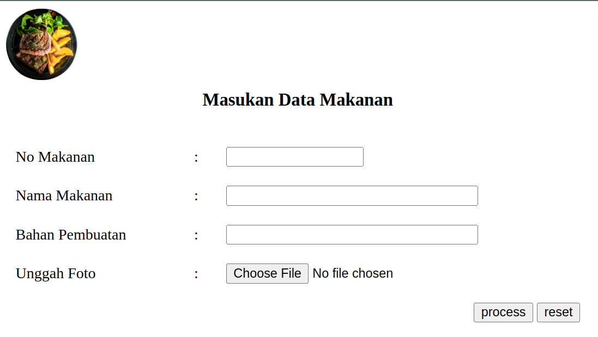
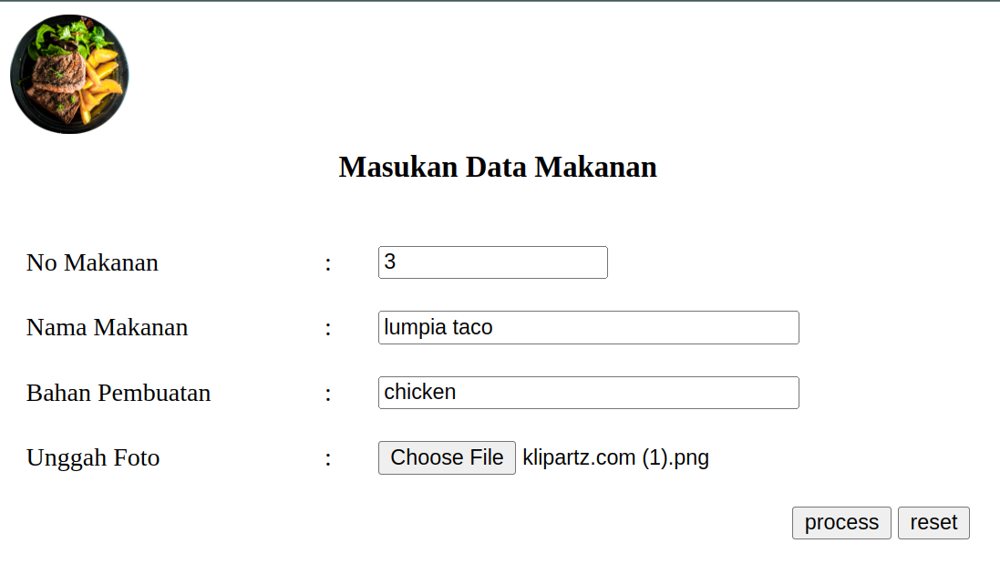
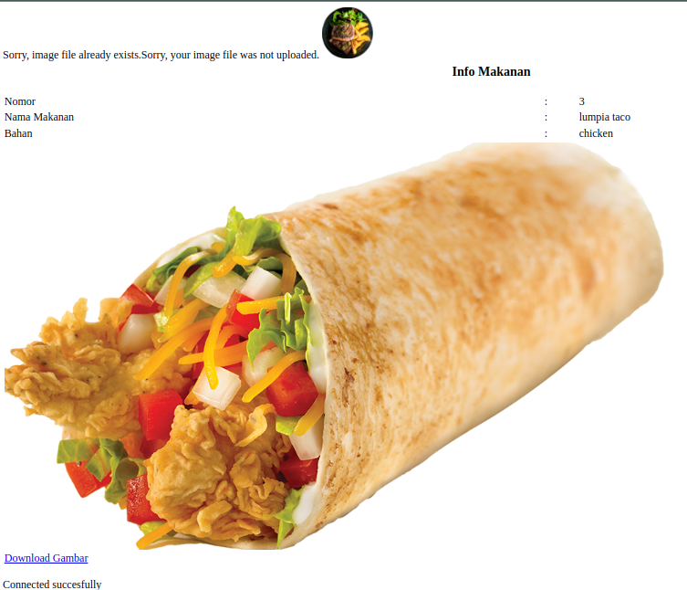
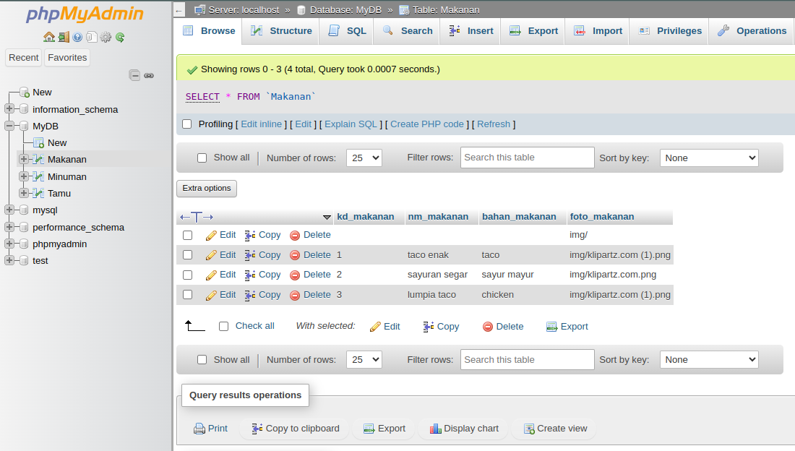
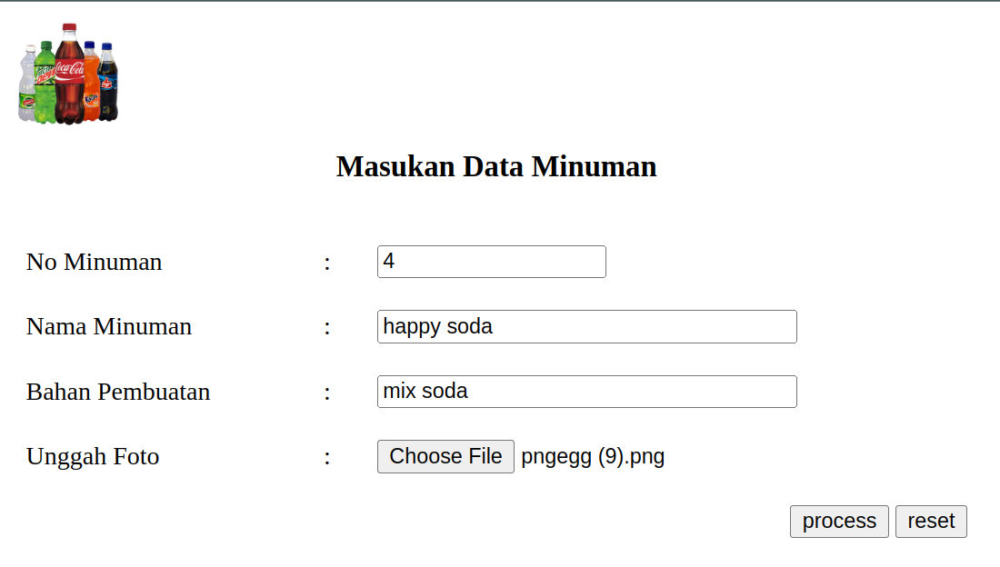
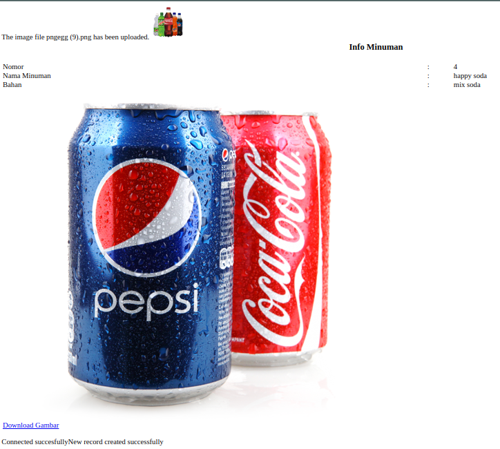
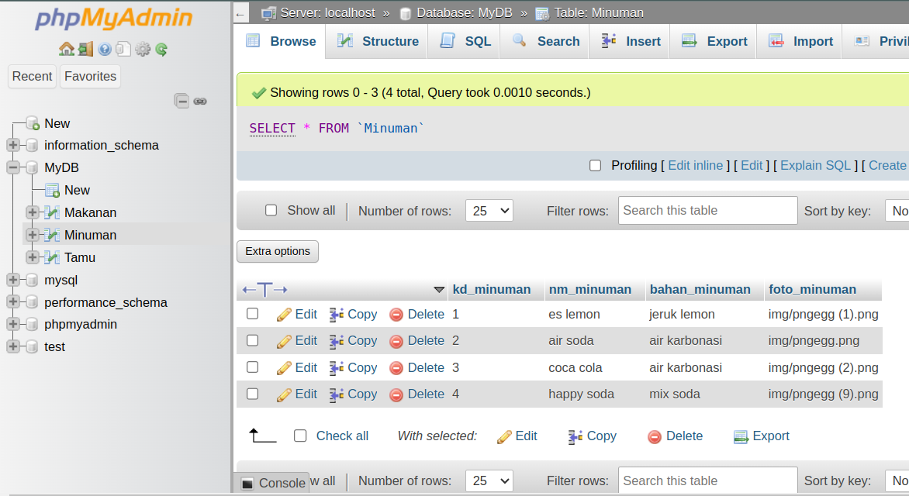

[ [<< Back](../README.md) ]

# Practical Module Archives 5: Web Database Management

[ [Module 5](../module5/) ]

## Overview

This document provides an extensive review of my recent work and outcomes from Module 5, aimed at documenting and providing learning resources for others. The purpose of creating this module is to introduce database management in web development and create a simple database using `MySQL`.

## Installation Requirements

For effective learning, you will need:
- A Compiler
- XAMPP
- A Browser

## Usage Guidelines

To effectively utilize these materials:
- You'll require a code editor; I use `Visual Studio Code`, but any other compiler is acceptable.
- Throughout your learning journey, you'll heavily rely on `XAMPP` for `Apache` operations in this module. Additionally, `phpMyAdmin` will be used to manage the database.
- A browser is essential for visualizing the output of the code created. You may use your preferred default browser.

## Module 5: Web Database Management

MySQL itself is the most popular database system used in PHP. Databases are stored in tables, where a table is a collection of related data, consisting of columns and rows. Databases are useful for storing information categorically, and PHP combined with MySQL is cross-platform and capable of handling large volumes of end-user data. Like Facebook, Twitter, and Wikipedia, MySQL can be scaled down to support embedded database applications.

### Practice 1



Here, we create an input table and a connection file that functions to connect from the input form we created to the database. We create a separate connection file that contains admin access and our target database because it will be called in different files later.

```php
<?php
$servername = "127.0.0.1";
$username = "root";
$password = "";
$db = "MyDB";

$conn = new mysqli($servername, $username, $password, $db);

if ($conn->connect_error) {
    die("Connection failed" . $conn->connect_error);
}
echo "Connected successfully";
?>
```

### Practice 2



This is an example of entering data before the data is sent to the output page and database.

### Practice 3



This is an example of the output page resulting from sending data from the input page, and the data is successfully sent to the database with a successful database connection as indicated by the status message at the bottom.

### Practice 4



Here, on kd 3, our data has been entered into the bottom database table.

### Task 1



We are trying with different data and a different table.

### Task 2



The output runs quite well.

### Task 3



The data is already displayed on the bottom table.

## Contribution

Feel free to fork this repository, and kindly acknowledge the source if used for learning purposes. Alternatively, clone this repository for personal learning.

## License

This repository is licensed under the [Apache License 2.0](https://www.apache.org/licenses/LICENSE-2.0.txt). For more details, refer to the [LICENSE](../LICENSE) file.

## Contact

I'm open to further discussions or collaborations. Please feel free to reach out via [Email](mailto:trustedintelegree@gmail.com).

## Additional Information

Reference: "Practical Module Guidebook for Web Engineering" by Agustian, Harliyus, S.Kom., M.Cs. Integrated Laboratory of Adisutjipto Institute of Aerospace Technology, Yogyakarta, 2024.

[ [<< Back](../README.md) ]