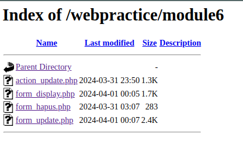
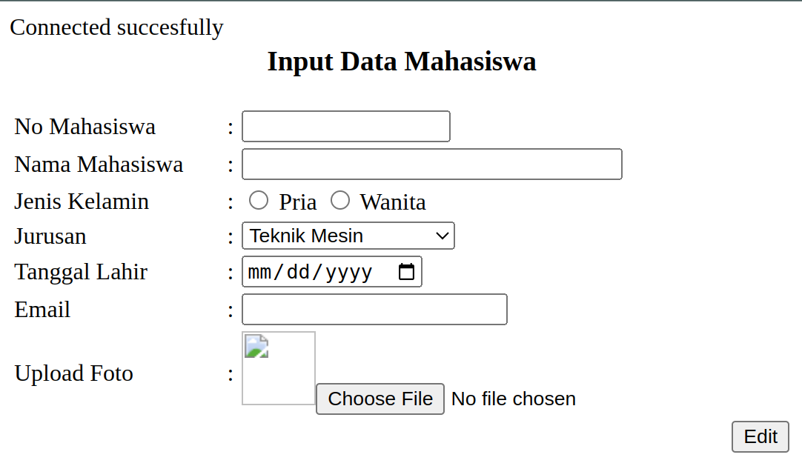
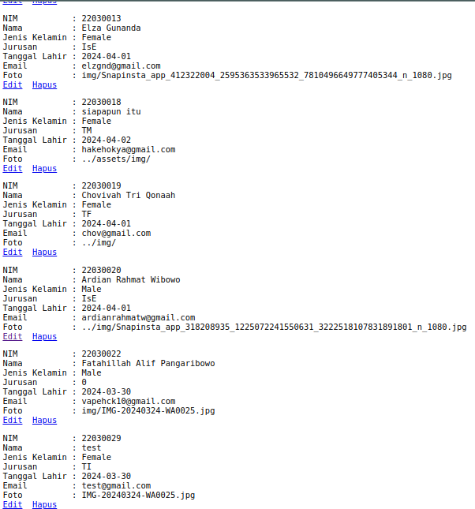
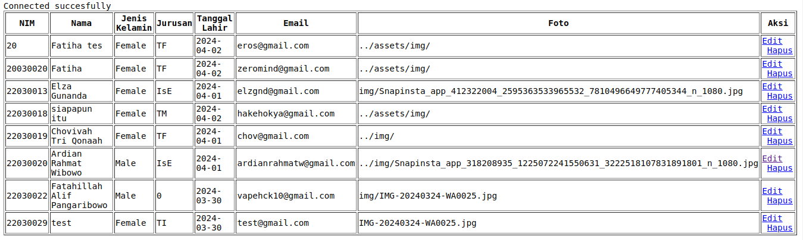
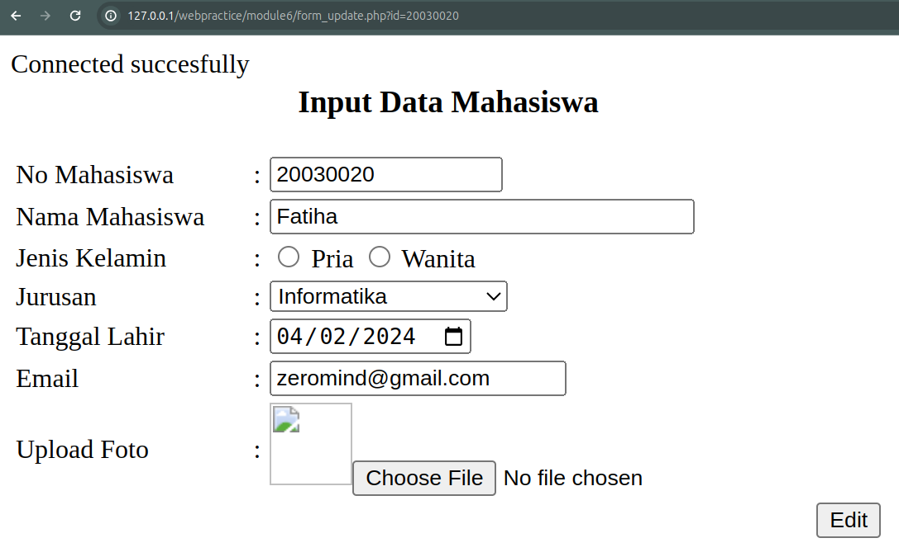
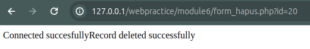

[ [<< Back](../README.md) ]

# Practical Module Archives 6: Data Manipulation Language

[ [Module 6](../module6/) ]

## Overview

This document provides an extensive review of my recent work and outcomes from Module 6, aimed at documenting and providing learning resources for others.

## Installation Requirements

For effective learning, you will need:
- A Compiler
- XAMPP
- A Browser

## Usage Guidelines

To effectively utilize these materials:
- You'll require a code editor; I use `Visual Studio Code`, but any other compiler is acceptable.
- Throughout your learning journey, you'll rely heavily on `XAMPP` for `Apache` operations in this module. Additionally, `phpMyAdmin` will be used to manage the database.
- A browser is essential for visualizing the output of the code created. You may use your preferred default browser.

## Module 6: Data Manipulation Language

DML (Data Manipulation Language) provides commands to help users manipulate data within a database, such as retrieving, deleting, and modifying existing data. The commands we'll be using include select, update, insert, and delete.

### Practice 1



This is the display of the file we've created to manage data from the database in our previous table.

### Practice 2



Here, we'll use this table to update data.

### Practice 3



The result of the select command is approximately like this, displaying all the data in the selected table.

```php
    $sql = "SELECT * FROM Tamu";
    $result = $conn->query($sql);

    echo "<a href = 'form_update.php?id=$row[nim]' id='edit'>Edit</a> &nbsp";
    echo "<a href = 'form_hapus.php?id=$row[nim]' id='edit'>Hapus</a>";
```

### Practice 4



This is the display when data is shown using an HTML table.

### Practice 5



This is the update command, where the selected data will be displayed for editing.

```php
$nim = $_GET['id'];
$sql = "SELECT * FROM Tamu Where nim='" . $nim ."'";
$result = $conn->query($sql);
```

### Practice 6



Here is the display that appears based on executing the delete command on our data table, and the data will be successfully deleted.

## Contribution

Feel free to fork this repository, and kindly acknowledge the source if used for learning purposes. Alternatively, clone this repository for personal learning.

## License

This repository is licensed under the [Apache License 2.0](https://www.apache.org/licenses/LICENSE-2.0.txt). For more details, refer to the [LICENSE](../LICENSE) file.

## Contact

I'm open to further discussions or collaborations. Please feel free to reach out via [Email](mailto:trustedintelegree@gmail.com).

## Additional Information

Reference: "Practical Module Guidebook for Web Engineering" by Agustian, Harliyus, S.Kom., M.Cs. Integrated Laboratory of Adisutjipto Institute of Aerospace Technology, Yogyakarta, 2024.

[ [<< Back](../README.md) ]