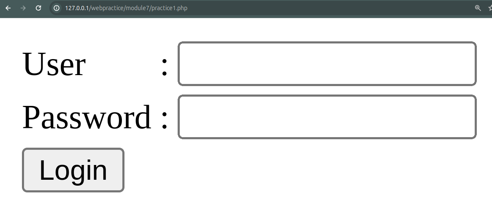

[ [<< Back](../README.md) ]

# Practical Module Archives 7: Cookies, Sessions, and Data Validation

[ [Module 7](../module7/) ]

## Overview

This document provides an in-depth review of my recent work and outcomes from Module 7, aimed at documenting and providing learning resources for others. This module aims to introduce data validation and create a PHP and MySQL web capable of performing validation checks.

## Installation Requirements

For effective learning, you will need:
- A Compiler
- XAMPP
- A Browser

## Usage Guidelines

To effectively utilize these materials:
- You'll require a code editor; I use `Visual Studio Code`, but any other compiler is acceptable.
- Throughout your learning journey, you'll rely heavily on `XAMPP` for `Apache` operations in this module. Additionally, `phpMyAdmin` will be used to manage the database.
- A browser is essential for visualizing the output of the code created. You may use your preferred default browser.

## Module 7: Cookies, Sessions, and Data Validation

DML (Data Manipulation Language) provides commands to help users manipulate data within a database, such as retrieving, deleting, and modifying existing data. The commands we'll be using include select, update, insert, and delete.

### Practice 1: Login Page



This is the login page created with HTML, which will be linked to all the pages we've created previously. In this practice, we will also create a system for checking cookies, sessions, and logout in separate files.

```html
<!DOCTYPE html>
<html>
<head> 
    <title>Login Page</title>
</head>
<body>
    <form name="login" action="logincheck.php" method="post" id="login">
        <table>
            <tr>
                <td>User</td> <td>:</td> <td><input name="txtid" type="text" id="txtid" size="15" maxlength="15" /></td>
            </tr>
            <tr>
                <td>Password</td> <td>:</td> <td><input name="txtsandi" type="password" id="txtsandi" size="15" maxlength="25" /></td>
            </tr>
            <tr>
                <td colspan="3"><input name="btnlogin" type="submit" id="btnlogin" value="Login" /></td>
            </tr>
        </table>
    </form>
</body>
</html>
```

```php
<?php 
session_start();
$_SESSION = array();
session_destroy();
header("location:practice1.php/");
exit();
?>
```

## Contribution

Feel free to fork this repository, and kindly acknowledge the source if used for learning purposes. Alternatively, clone this repository for personal learning.

## License

This repository is licensed under the [Apache License 2.0](https://www.apache.org/licenses/LICENSE-2.0.txt). For more details, refer to the [LICENSE](../LICENSE) file.

## Contact

I'm open to further discussions or collaborations. Please feel free to reach out via [Email](mailto:trustedintelegree@gmail.com).

## Additional Information

Reference: "Practical Module Guidebook for Web Engineering" by Agustian, Harliyus, S.Kom., M.Cs. Integrated Laboratory of Adisutjipto Institute of Aerospace Technology, Yogyakarta, 2024.

[ [<< Back](../README.md) ]